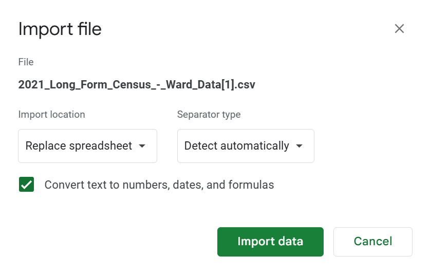
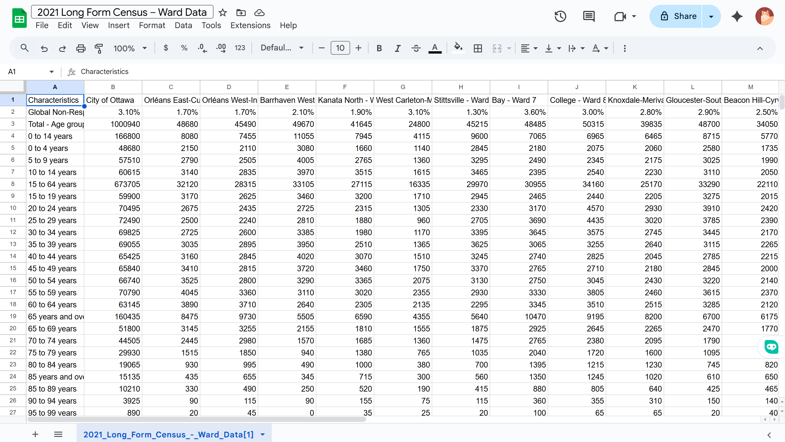
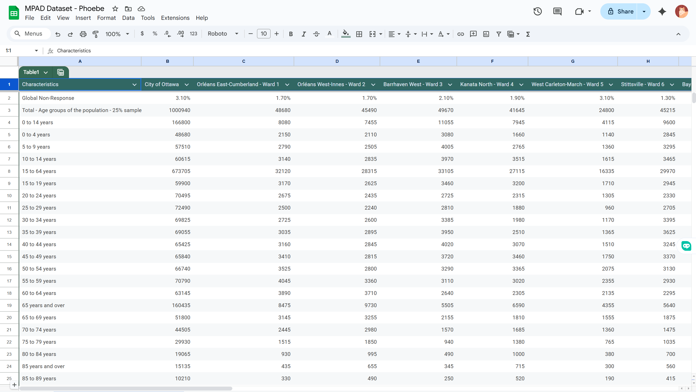
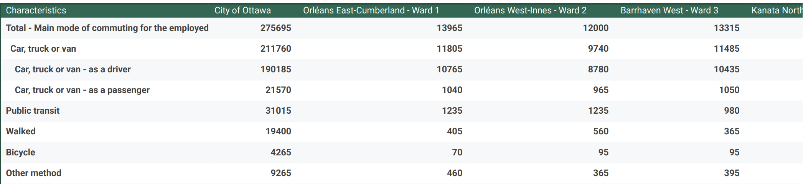

**November 24, 2025** 
**MPAD 2003A Introductory Storytelling** 
**Phoebe Corpus** 
**Presented to Jean-Sébastien Marier** 

# How Ottawa Moves: An EDA of Urban, Suburban, and Rural Commuting Patterns

## 1. Introduction

The dataset referred to is data from the **2021 Canadian Long-Form Census** which includes data grouped by the 24 municipal wards in the City of Ottawa. It possesses hundreds of demographic and social variables including, but not limited to, age groups, language, income, household attributes, commute information, and different commuting types. Previously, data was gathered from Statistics Canada, but it is publicly available through the City of Ottawa’s Open Data Portal. For this project, these are the main data used:

**CSV link:**  
https://raw.githubusercontent.com/jsmarier/files-for-course-assignments/refs/heads/main/2021_Long_Form_Census_-_Ward_Data.csv  

**Original dataset:**  
https://open.ottawa.ca/datasets/ottawa::2021-long-form-census-ward-data

For my exploratory analysis, I chose to focus on **commuting patterns**, as this part of the dataset clearly illustrates how people in various areas of Ottawa get to work. The census encompasses multiple modes of transport, including driving, public transit use, walking, cycling, or other methods. These choices vary among people based on location, which is why I want to compare commuting behavior in **downtown**, **suburban** and **rural** wards and find how neighbourhood design and distance affect people’s daily commute. The sections that follow present how I imported/processed the dataset, assessed its quality with a VIMO, generated a pivot table and exploratory chart, and crafted a potential story from the observations I presented.

## 2. Getting Data

To start this assignment, I downloaded a CSV copy of the **2021 Long Form Census Ward Data** from the City of Ottawa’s Open Data Portal that was provided. I then imported the file into Google Sheets by going to **File, Import, and pasting the CSV link**.

  
*Figure 1: Importing the CSV file into Google Sheets.*
After import, Google Sheets displayed the raw dataset containing 2,602 rows and 26 columns. Each row represents a demographic or social variable, while each column represents Ottawa as a whole plus each of the 24 wards.  I reviewed the dataset to confirm that all categories and ward values were correctly aligned.

  
*Figure 2: Raw dataset after import.*

To make the file easier to navigate, I converted the sheet into a formatted table using Ctrl + A, Format, convert to table. This added basic formatting and filters, which helped when scrolling through long sections of the dataset. 

  
*Figure 3: Slightly formatted dataset.*

Since my analysis focuses on commuting behaviour, I then located the section that lists different modes of transportation. The rows I highlighted include:

- Car, truck, or van - as a driver  
- Car, truck, or van - as a passenger  
- Public transit  
- Walked  
- Bicycle  
- Other method  

  
*Figure 4: Highlighted transportation-related rows.*

These rows will be used later to compare commuting patterns across three types of wards: **Somerset (urban), Barrhaven West (suburban), and West Carleton–March (rural).**

## Specific Observations
After reviewing the transportation section of the dataset, clear differences appeared between the three selected wards. 
1. **Somerset (Urban – Ward 14)**
This area's *low car usage* and high presence of walking and public transit demonstrate Somerset's comparison with other wards. It fits into its downtown location, dense housing, and closeness to worksites, stores, and transit stations. 
2. **Barrhaven West (Suburban – Ward 3)**
This area has *very high car commuters*, with driving being the predominant mode of transport. Walking, cycling, and numbers in transit are much lower. In line with the ward’s suburban design, longer distances and limited walkability. 
3. **West Carleton–March (Rural – Ward 5)**
This ward shows the *highest overall dependence on cars*, with very low walking, cycling or transit use. This makes sense given the rural setting, extensive geographic range, and few transit options

## Hypothesis
Considering the dataset format, I expect commuting behaviour to vary depending on whether a ward is **urban, suburban, or rural**. People living downtown (such as Somerset, Ward 14) will likely rely less on personal vehicles and use more public transit, walking, or cycling. On the other hand, suburban areas such as Barrhaven West (Ward 3) are predicted to see increased car commuting, with fewer people walking or using transit. Whereas rural wards such as West Carleton–March (Ward 5) will almost entirely depend on driving because of longer distances and limited public transit.

## 3. Understanding Data

### 3.1. VIMO Analysis

Use three hashtag symbols (`###`) to create a level 3 heading like this one. Please follow this template when it comes to level 1 and level 2 headings. However, you can use level 3 headings as you see fit.

Insert text here.

Support your claims by citing relevant sources. Please follow [APA guidelines for in-text citations](https://apastyle.apa.org/style-grammar-guidelines/citations).

**For example:**

As Cairo (2016) argues, a data visualization should be truthful...

### 3.2. Cleaning Data

Insert text here.

### 3.3. Exploratory Data Analysis (EDA)

Insert text here.

**This section should include a screen capture of your pivot table, like so:**

 
*Figure 2: This pivot table shows...*

**This section should also include a screen capture of your exploratory chart, like so:**

 
*Figure 3: This exploratory chart shows...*

## 4. Potential Story

Insert text here.

## 5. Conclusion

Insert text here.

## 6. References

Include a list of your references here. Please follow [APA guidelines for references](https://apastyle.apa.org/style-grammar-guidelines/references). Hanging paragraphs aren't required though.

**Here's an example:**

Bounegru, L., & Gray, J. (Eds.). (2021). *The Data Journalism Handbook 2: Towards A Critical Data Practice*. Amsterdam University Press. [https://ocul-crl.primo.exlibrisgroup.com/permalink/01OCUL_CRL/hgdufh/alma991022890087305153](https://ocul-crl.primo.exlibrisgroup.com/permalink/01OCUL_CRL/hgdufh/alma991022890087305153)
