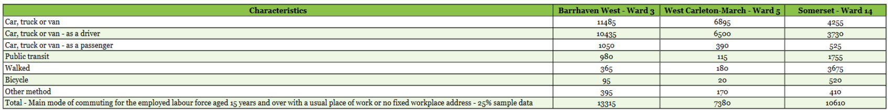
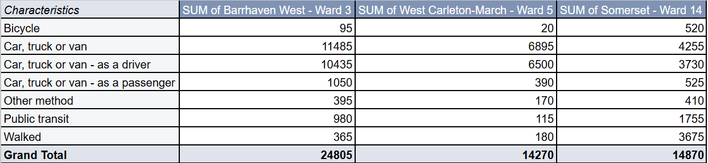
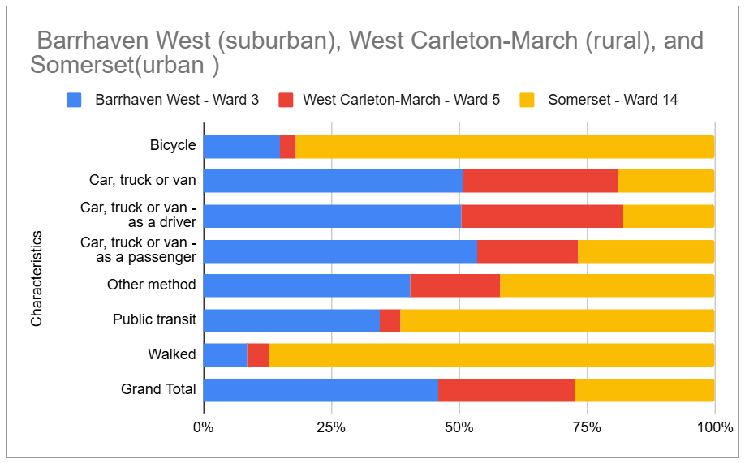

**November 24, 2025** 
**MPAD 2003A Introductory Storytelling** 
**Phoebe Corpus** 
**Presented to Jean-Sébastien Marier** 

# How Ottawa Moves: An EDA of Urban, Suburban, and Rural Commuting Patterns

## 1. Introduction

The dataset referred to is data from the **2021 Canadian Long-Form Census** which includes data grouped by the 24 municipal wards in the City of Ottawa. It possesses hundreds of demographic and social variables including, but not limited to, age groups, language, income, household attributes, commute information, and different commuting types. Previously, data was gathered from Statistics Canada, but it is publicly available through the City of Ottawa’s Open Data Portal. For this project, these are the main data used:

**CSV link:**  
https://raw.githubusercontent.com/jsmarier/files-for-course-assignments/refs/heads/main/2021_Long_Form_Census_-_Ward_Data.csv  

**Original dataset:**  
https://open.ottawa.ca/datasets/ottawa::2021-long-form-census-ward-data

For my exploratory analysis, I chose to focus on **commuting patterns**, as this part of the dataset clearly illustrates how people in various areas of Ottawa get to work. The census encompasses multiple modes of transport, including driving, public transit use, walking, cycling, or other methods. These choices vary among people based on location, which is why I want to compare commuting behavior in **downtown**, **suburban** and **rural** wards and find how neighbourhood design and distance affect people’s daily commute. The sections that follow present how I imported/processed the dataset, assessed its quality with a VIMO, generated a pivot table and exploratory chart, and crafted a potential story from the observations I presented.

## 2. Getting Data

To start this assignment, I downloaded a CSV copy of the **2021 Long Form Census Ward Data** from the City of Ottawa’s Open Data Portal that was provided. I then imported the file into Google Sheets by going to **File, Import, and pasting the CSV link**.

   
*Figure 1: Importing the CSV file into Google Sheets.*
After import, Google Sheets displayed the raw dataset containing 2,602 rows and 26 columns. Each row represents a demographic or social variable, while each column represents Ottawa as a whole plus each of the 24 wards.  I reviewed the dataset to confirm that all categories and ward values were correctly aligned.

 
*Figure 2: Raw dataset after import.*

To make the file easier to navigate, I converted the sheet into a formatted table using Ctrl + A, Format, convert to table. This added basic formatting and filters, which helped when scrolling through long sections of the dataset. 

 
*Figure 3: Slightly formatted dataset.*

Since my analysis focuses on commuting behaviour, I then located the section that lists different modes of transportation. The rows I highlighted include:

- Car, truck, or van - as a driver  
- Car, truck, or van - as a passenger  
- Public transit  
- Walked  
- Bicycle  
- Other method  
- Total – Main mode of commuting 

   
*Figure 4: Highlighted transportation-related rows.*

These rows will be used later to compare commuting patterns across three types of wards: **Somerset (urban), Barrhaven West (suburban), and West Carleton–March (rural).**

## Specific Observations
After reviewing the transportation section of the dataset, clear differences appeared between the three selected wards. 
1. **Somerset (Urban – Ward 14)**
This area's *low car usage* and high presence of walking and public transit demonstrate Somerset's comparison with other wards. It fits into its downtown location, dense housing, and closeness to worksites, stores, and transit stations. 
2. **Barrhaven West (Suburban – Ward 3)**
This area has *very high car commuters*, with driving being the predominant mode of transport. Walking, cycling, and numbers in transit are much lower. In line with the ward’s suburban design, longer distances and limited walkability. 
3. **West Carleton–March (Rural – Ward 5)**
This ward shows the *highest overall dependence on cars*, with very low walking, cycling or transit use. This makes sense given the rural setting, extensive geographic range, and few transit options

## Hypothesis
Considering the dataset format, I expect commuting behaviour to vary depending on whether a ward is **urban, suburban, or rural**. People living downtown (such as Somerset, Ward 14) will likely rely less on personal vehicles and use more public transit, walking, or cycling. On the other hand, suburban areas such as Barrhaven West (Ward 3) are predicted to see increased car commuting, with fewer people walking or using transit. Whereas rural wards such as West Carleton–March (Ward 5) will almost entirely depend on driving because of longer distances and limited public transit.

## 3. Understanding Data

### 3.1. VIMO Analysis

Before comparing commuting patterns, I used the VIMO framework (Valid, Invalid, Missing, Outlier) to check whether the data was reliable. Since the dataset comes from the 2021 Canadian Long-Form Census, it is already considered high-quality, but it was still important to confirm its accuracy before analyzing it. According to Statistics Canada (2021), accuracy refers to how well data reflects real-world conditions, and checking for validity, missing values, and outliers is a key step in responsible data use.

**Valid Data:**  
The commuting variables clearly measure what they are supposed to. Categories like “Car, truck or van – as a driver,” “Public transit,” “Walked,” and “Bicycle” come directly from census questions about how people usually travel to work. Statistics Canada (2021) explains that valid data must reflect real behaviour and fall within a realistic range. For example, Somerset’s higher walking and transit use matches what we would expect from a dense downtown ward, which supports the validity of the data.

**Invalid Data:**  
Invalid data would include values that do not make sense, like mixing up driver and passenger categories. Statistics Canada (2021) warns that misuse of variables can lead to incorrect conclusions even if the dataset itself is accurate. To avoid this, I kept all categories separate and used the census definitions consistently.

**Missing Data:**  
There were no empty cells in the commuting rows I used. Some values, especially for walking and cycling in rural wards, were very low, but these reflect real conditions rather than missing data. As Statistics Canada (2021) notes, low values should not automatically be treated as missing if they align with real-world patterns.

**Outliers:**  
Somerset stood out with much higher walking and transit use, while Barrhaven West and West Carleton–March showed very high car dependence. According to Statistics Canada (2021), outliers are not always errors and can reveal meaningful differences in population behaviour, which is exactly what happens here.

Overall, the VIMO analysis confirms that the commuting data is accurate and reliable, making it appropriate for exploring how transportation behaviour differs across Ottawa’s urban, suburban, and rural wards.

### 3.2. Cleaning Data

To clean the dataset for my analysis, I began by applying Trim Whitespace to remove any hidden spaces in the “Characteristics” column. This kept the row labels consistent and prevented issues when filtering or organizing the data. I also used the Remove duplicates tool to ensure the dataset did not contain repeated rows. 
Next, I froze the header row so that the ward names remained visible while scrolling through the spreadsheet. Because the dataset is huge, freezing the header made it easier to compare values across Somerset, Barrhaven West, and West Carleton–March. I also applied alternating row colours, added cell borders, adjusted the font, and center-aligned the values to improve readability and keep the commuting section visually organized.   
After that, I manually removed rows and columns that were not relevant to my project I excluded the overall “City of Ottawa” column because my analysis focuses on comparing three specific wards rather than citywide totals, and keeping the aggregate values would have made the comparisons less meaningful. I isolated and grouped the rows that contain transportation data:

- Car, truck, or van - as a driver  
- Car, truck, or van - as a passenger  
- Public transit  
- Walked  
- Bicycle  
- Other method 
- Total – Main mode of commuting 

 
*Figure 4: Cleaned Commuting Table.*

I created a smaller working table with just these rows and the three wards I am analyzing: **Barrhaven West, West Carleton–March, and Somerset.** Organizing the data this way made it easier to work with in the next step of the assignment. 

These cleaning steps ensured that the dataset was organized, consistent, and ready for the exploratory analysis in Section 3.3.

### 3.3. Exploratory Data Analysis (EDA)

Once my dataset was fully cleaned and reorganized, I began exploring patterns in how residents from three different Ottawa wards commute to work. Instead of analyzing all 24 wards, I focused on three that clearly represent different community types in Ottawa:

- Somerset (Ward 14) -  urban

- Barrhaven West (Ward 3) -  suburban

- West Carleton-March (Ward 5) - rural

This allowed me to see how neighbourhood design and geography might influence commuting behaviour. I first created a pivot table in Google Sheets using the cleaned commuting-related rows.

**Pivot table setup (Google Sheets)**

**Rows:** Characteristics (Bicycle, Car, Public transit, Walked, etc.)
**Columns:** Barrhaven West, West Carleton-March, Somerset
**Values:** SUM of commuters in each category
 This produced a side-by-side comparison of commuting modes across the three wards.

 
*Figure 2: Pivot Table showing commuting modes across three Ottawa wards*

This pivot table made initial differences visible. Somerset had noticeably higher counts for walking and cycling, while the suburban and rural wards showed far greater reliance on cars.

**Percentage Bar Chart (Exploratory Visualization)**

 
*Figure 3: Percentage distribution of commuting modes across urban, suburban, and rural wards*

Raw totals alone can be misleading since each ward has a different population size. To compare commuting behaviours fairly, I created a **100% stacked bar chart**, which shows the proportion of each commuting mode within each ward.
 
Based on this exploratory analysis, I chose these three wards because they represent three distinct environments in Ottawa: **urban, suburban, and rural**. This made it easier to see how geography and neighbourhood design might influence commuting habits. The pivot table and percentage bar chart revealed several clear patterns. **Somerset (urban)** had the highest share of walking, biking, and public transit use, while **Barrhaven West (suburban)** remained mostly car-dependent with some transit and active transportation. **West Carleton-March (rural)** showed almost exclusive reliance on personal vehicles.
 
These findings suggest that the built environment plays a major role in shaping how people commute. A potential story could explore how commuting patterns differ across Ottawa’s communities and what this means for transportation planning and sustainability. For further investigation, it would be useful to examine variables such as median income, transit access, and vehicle ownership to better understand what drives these differences. 

## 4. Potential Story

For the potential story, I’d want to go beyond just comparing commuting patterns and look at why certain neighbourhoods rely so heavily on cars while others don’t. The data already shows a huge divide between urban, suburban, and rural wards, so the next step would be connecting those patterns to Ottawa’s larger transportation issues. 
Some writers have already pointed out that the city’s infrastructure is struggling to keep up. For example, Singh (2025) highlights how Ottawa’s continued dependence on its private vehicles makes sustainable travel difficult, especially in winter. Desveaux (2024) takes an even stronger stance, arguing that the lack of a north–south subway is preventing the region from functioning efficiently and holding back economic growth. Meanwhile, Gower (2024) mentions that high car ownership rates, especially in suburban and rural areas, are simply the result of limited alternatives, which helps explain why places like Barrhaven and West Carleton remain so car-dependent. 
**Transit reliability is another layer of the story.** The LRT’s ongoing failures have damaged public trust; TVO’s timeline shows years of shutdowns, derailments, and safety issues that frustrated riders and delayed progress. More recently, a CBC investigation revealed that design flaws and “soft tracks” contributed to derailments (White-Crummey, 2025), adding even more context about why so many residents still hesitate to rely on transit. 
To fully tell this story, I would want to interview planners, councillors, and everyday commuters from the wards in my dataset. Bringing these perspectives together could show how neighbourhood design, car ownership, and transit failures all shape how people choose to get to work and what that means for Ottawa’s transportation future.

## 5. Conclusion

Working through this assignment honestly taught me more about Ottawa’s transportation patterns
than I expected. The hardest part was probably organizing and cleaning such a huge dataset,
especially making sure that the variables were consistent and meaningful before I started
analyzing anything. But once the data was cleaned, the patterns became way easier to see, and
that was actually the most rewarding part. It felt good when everything finally clicked.  
One thing I realized is how much neighbourhood design shapes people’s commuting habits.
**Urban wards like Somerset** naturally support walking, biking, and transit, while **suburban and
rural wards** almost force people into car ownership. Seeing that in the data made the story feel
real. It also showed me where my own knowledge had gaps. For example, I didn’t know how
much Ottawa’s transit issues (like the LRT derailments and reliability problems) influenced
people’s decision-making until I started reading more research.  
If I could redo anything, I’d probably bring in additional demographic variables earlier, like
income or household size, because they might explain even more of the differences between
wards. Overall, this assignment helped me understand not just the numbers in the census, but
how data, geography, and infrastructure come together to shape everyday life in the city

## 6. References

ChatGPT. (2025). Used for drafting, editing, and citation formatting [AI model]. OpenAI.  
https://www.openai.com/

Desveaux, C. P. (2025). Ottawa’s transit crisis: Why a subway could save the city. LinkedIn.  
https://www.linkedin.com/pulse/ottawas-transit-crisis-subway-could-save-city-clinton-p-desveaux-v5poc/

Gower, G. (2024, July 7). Transportation trends in Ottawa (Part 3): Vehicle ownership. Straight Outta Stittsville.  
https://glengower.substack.com/p/transportation-trends-in-ottawa-part-640

Grammarly, Inc. (2025). Used for grammar and clarity support [Writing assistance software].  
https://www.grammarly.com

Singh, A. (2025, January 23). Environmental transportation challenges in Ottawa. Ottawa Name.  
https://ottawa.name/en/eternal-3780-environmental-transportation-challenges-in-ottawa

Statistics Canada. (2021). Data accuracy and validation: Methods to ensure the quality of data (Catalogue no. 892000062020008).  
https://www.statcan.gc.ca/en/wtc/data-literacy/catalogue/892000062020008

Trick, S. (2022, January 14). Ottawa’s colossal LRT debacle: A brief-ish history. TVO Today.  
https://www.tvo.org/article/ottawas-colossal-lrt-debacle-a-brief-ish-history

White-Crummey, A. (2025, July 21). Alstom report blamed soft tracks, design flaws for LRT derailment. CBC News.  
https://www.cbc.ca/news/canada/ottawa/ottawa-lrt-train-wheel-rail-problem-report-1.7588002

